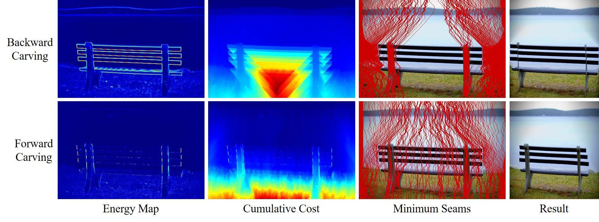
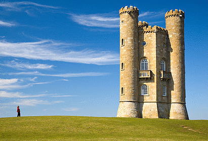

# Seam Carving & Real-ESRGAN Video Upscaler

This project contains implementations for:
1. **Seam Carving (Content-Aware Image Flattening)**
2. **Real-ESRGAN (AI-Based Video Upscaling)**

## Project Structure
```
📂 Project Root
├── 📂 images                 # Stores sample images and videos
├── 📂 Seam-Carving           # Seam carving implementation
│   ├── energy_functions.py   # Functions for calculating energy maps
│   ├── flattening.py         # Main script for seam carving (flattening)
│   ├── test_seam_carver.py   # Unit tests for seam carving
│   ├── utils.py              # Utility functions
├── 📂 Real-ESRGAN            # AI-based video upscaling implementation
│   ├── upscale.py            # Main script for upscaling videos
│   ├── (Real-ESRGAN files)   # Required dependencies for Real-ESRGAN
└── README.md                 # Project documentation
```

## Installation & Setup
### 1. Clone the Repository
```bash
git clone https://github.com/ozanguneyli/your-repository.git
cd your-repository
```
### 2. Create a Virtual Environment & Install Dependencies
```bash
python -m venv venv
source venv/bin/activate  # On Windows: venv\Scripts\activate
pip install -r requirements.txt
```

## Usage
### 1. Seam Carving (Image Flattening)






Run the following command to process an image using seam carving:
```bash
python Seam-Carving/flattening.py image_name -a y -p 100 -o image_name.jpg
```
- `<input_image>`: Path to the input image
- `-a, --axis`: Specifiec the axis along which the image will be reduced:
    - `x`: Reduces the width (removes vertical seams).
    - `y`: Reduces the height (removes horizontal seams).
- `-p, --pixels`: Specifies the number of pixels to shrink the image by.
- `-o, --output`: The filename where the processed image will be saved.
- `-i, --interval` (optional): Saves intermediate images at specified intervals during the process.
- `-b, --border` (optional): Adds a black border to maintain the original image dimensions after cropping.
- `-s, --show_seam` (optional): Highlights the seams that are being removed for visualization purposes.

### 2. Video Upscaling with Real-ESRGAN


Run the following command to upscale a video:
```bash
python Real-ESRGAN/upscale.py --input videos/input.mp4 --output videos/output.mp4 --scale 4
```
- `--input`: Path to the input video
- `--output`: Path to save the upscaled video
- `--scale`: Upscaling factor (e.g., `4` for 4x resolution)

## Testing
To run unit tests for the Seam Carving module:
```bash
pytest Seam-Carving/test_seam_carver.py
```

## License
This project includes Real-ESRGAN, which is licensed under [Real-ESRGAN's license]. See `LICENSE` under the Real-ESRGAN file for details.

[MIT License](LICENSE)

